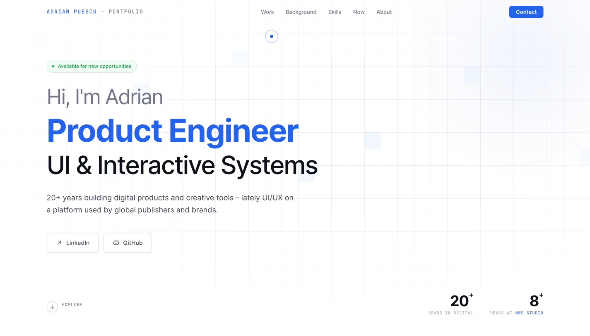

# Portfolio — Adrian Puescu

**Live site:** [portfolio.webz.ro](https://portfolio.webz.ro)



Personal portfolio for a product engineer focused on UI and interactive systems. This repository is the full source for that site: Next.js (App Router), static export, and a componentized page built for clarity and maintainability.

If you are reviewing this repo from GitHub: clone it, run it locally, and compare the code to the deployed experience—that is the intended flow.

## What this repo is meant to show

- **Product-facing UI** — Section-based layout, scroll-driven presentation, video and imagery handled intentionally for a portfolio context.
- **Modern React** — Client page composition, typed section components, refs where needed (e.g. video coordination).
- **Stack choices** — Next.js with **static export** (`output: "export"`), TypeScript, Tailwind CSS v4 for globals and tokens, plus **`portfolio.css`** for layout and design-specific rules so concerns stay separated.

## Tech

| Area | Details |
|------|---------|
| Framework | **Next.js 16** (App Router), **React 19**, **TypeScript** |
| Styling | **Tailwind CSS v4** (`app/globals.css`) + **`app/portfolio.css`** (portfolio layout and tokens) |
| Fonts | **next/font** — Inter, JetBrains Mono |
| Tooling | **pnpm** (see `packageManager` in [package.json](./package.json)) |

## Prerequisites

- **Node.js** — Current LTS (e.g. 22.x) works well with this project.
- **pnpm** — Install via [pnpm.io](https://pnpm.io/installation) or enable with Corepack: `corepack enable`.

## Scripts

| Command | Purpose |
|---------|---------|
| `pnpm dev` | Local development server |
| `pnpm build` | Production build (static export to `out/`) |
| `pnpm start` | Serves the production build (after build) |

## Getting started

```bash
pnpm install
pnpm dev
```

Open [http://localhost:3000](http://localhost:3000).

## Project layout

- **`app/`** — `page.tsx` (main portfolio page), `layout.tsx`, `globals.css`, `portfolio.css`
- **`components/portfolio/`** — Nav, Hero, VideoSection, WorkSection, BeforeSection, SkillsSection, FocusSection, AboutSection, ContactSection, Footer, Cursor, ScrollReveal, SocialIcons, HtmlComment
- **`hooks/`** — Shared hooks (e.g. `use-mobile`)
- **`scripts/`** — Build helpers (e.g. HTML comment injection after export)
- **`bin/`** — Optional automation for packaging the static output (not required to run or build locally)
